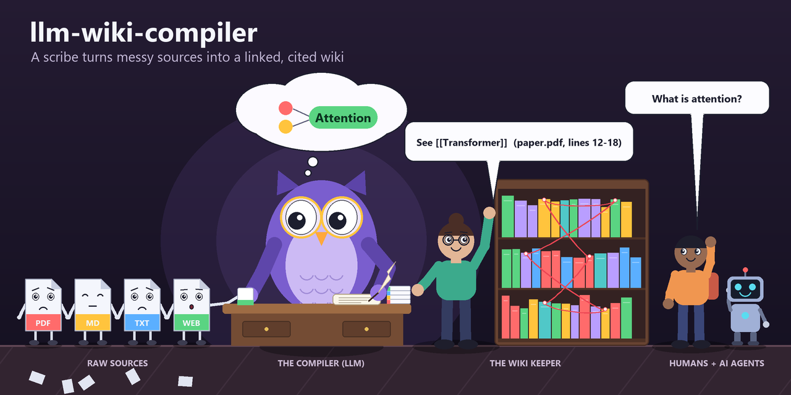
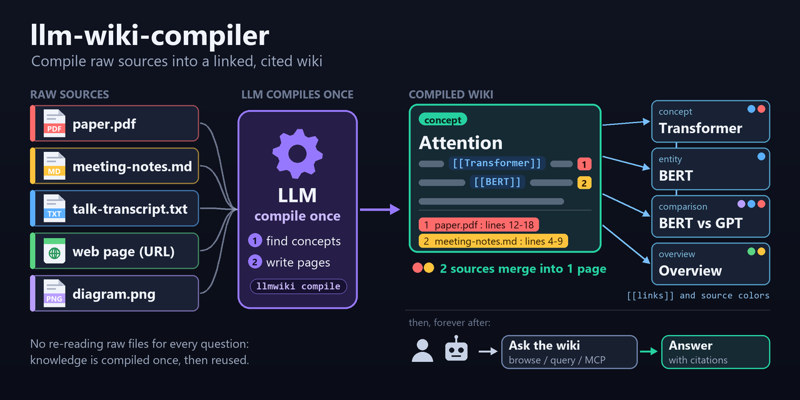

<p align="center">
  
</p>

<h1 align="center">llm-wiki-compiler</h1>

<p align="center"><b>Компилирует сырые источники в связанную markdown-вики с прослеживаемыми цитатами — а затем позволяет её просматривать, опрашивать, проверять, линтить, экспортировать и отдавать людям и ИИ-агентам; для предметных баз знаний есть необязательные профили.</b></p>

<p align="center">
  <a href="LICENSE"></a>
  <a href="package.json"></a>
  <a href="tsconfig.json"></a>
  <a href="https://www.npmjs.com/package/llm-wiki-compiler"></a>
  <a href="https://llmwiki.atomicstrata.ai"></a>
</p>

<p align="center"><a href="README.md">English</a> | <b>Русский</b></p>

> Форк [atomicstrata/llm-wiki-compiler](https://github.com/atomicstrata/llm-wiki-compiler). Лицензия и авторство оригинального проекта сохранены без изменений. Ветка `main` этого форка может отличаться от версии, опубликованной в npm.

```bash
npm install -g llm-wiki-compiler
llmwiki quickstart ./notes.md      # принять один источник, скомпилировать страницы, открыть просмотрщик
llmwiki query "what are the key ideas?"
```

**llmwiki** (CLI этого репозитория; npm-пакет `llm-wiki-compiler`) компилирует сырые источники в связанную markdown-вики с прослеживаемыми цитатами, которую агенты и люди могут просматривать, опрашивать, линтить, экспортировать и переиспользовать. Профиль по умолчанию сохраняет классическую раскладку «концепты и запросы»; необязательные профили добавляют предметно-специфичные типы и рабочие процессы, не добавляя предметных веток в сам компилятор.

llmwiki реализует паттерн [LLM Wiki](https://gist.github.com/karpathy/442a6bf555914893e9891c11519de94f): вместо того чтобы заново выуживать знания из сырых файлов в момент запроса, их один раз компилируют в долговечные страницы, которые со временем накапливают структуру, происхождение, статус проверки и метаданные для поиска.

Вокруг компилятора в репозитории есть приём источников нескольких типов, инкрементальная перекомпиляция и обновление устаревших страниц, обоснованные ответы на вопросы и готовые для агентов контекстные пакеты, локальный просмотрщик только для чтения, очередь проверки с необязательной политикой проверки, lint и набор для оценки качества (eval), MCP-сервер и TypeScript SDK, экспорт в Open Knowledge Format и другие форматы, несколько LLM-провайдеров и настраиваемые профили жизненного цикла (типизированные сущности, связи, рабочие процессы, артефакты, коннекторы) с двумя встроенными шаблонами.

Это ранняя версия ПО, и не все её поверхности одинаково устоялись: команды `workflow` помечены в справке CLI как экспериментальные, методы SDK для профилей, рабочих процессов и артефактов помечены `@experimental`, а несколько пунктов всё ещё числятся в разделе *Unreleased* [журнала изменений](CHANGELOG.md). См. [Статус и известные ограничения](#статус-и-известные-ограничения).

> **Новое в 1.0:** Настраиваемые профили жизненного цикла (Configurable Lifecycle Profiles) превращают llmwiki в переиспользуемую основу для предметных баз знаний. В одном проверяемом профиле объявляются типизированные сущности, связи, шлюзы жизненного цикла, рабочие процессы, артефакты, коннекторы и политика поиска. Начните со встроенного исследовательского пакета `autosci` или заметно отличающегося редакционного пакета `newsroom`, либо установите локальный декларативный шаблон.

**Содержание:** [Простыми словами](#простыми-словами) · [Что внутри](#что-внутри) · [Зачем нужен llmwiki?](#зачем-нужен-llmwiki) · [Как это работает](#как-это-работает) · [Быстрый старт](#быстрый-старт) · [Профили (CLP)](#настраиваемые-профили-жизненного-цикла-clp) · [Руководство для агентов](#руководство-для-агентов) · [Основные команды](#основные-команды) · [Open Knowledge Format](#open-knowledge-format) · [Что создаёт llmwiki](#что-создаёт-llmwiki) · [Интеграция с агентами](#интеграция-с-агентами) · [Конфигурация](#конфигурация) · [Качество и безопасность](#модель-качества-и-безопасности) · [Статус и ограничения](#статус-и-известные-ограничения) · [Документация](#документация) · [Участие в разработке](#участие-в-разработке)

## Простыми словами

### Проблема

Заметки, статьи, README, транскрипты, PDF и сохранённые веб-страницы копятся как россыпь файлов. Искать в них — значит перечитывать их, а расспрашивать о них ИИ — значит каждый раз заново отправлять сырой текст: ничего не запоминается, связанные идеи из разных файлов не объединяются, и, получив ответ, трудно понять, из какого источника он взят и не изменился ли этот источник с тех пор.

### Для кого

Для людей и команд, у которых есть коллекция источников, из которой стоит сделать долговечные знания, — папка исследований, документация кодовой базы, справочник команды, стандарты, заметки по дизайну, журналы решений. Для тех, кто делает ИИ-агентов и хочет, чтобы те читали один стабильный контекстный пакет с цитатами, а не сырые файлы. Опытные пользователи могут добавить шлюзы проверки, пороги качества для CI, типизированную предметную модель (профили) или встроить компилятор через MCP или TypeScript.

### Что вы получаете

- **Вики, которую можно читать как обычные файлы.** Страницы — markdown с YAML frontmatter в `wiki/`, связанные через `[[wikilinks]]`; раскладку можно открыть как хранилище Obsidian.
- **Утверждения, которые можно проследить.** Страницы ссылаются на исходные файлы и диапазоны строк, а `llmwiki lint` проверяет, что эти цитаты и ссылки разрешаются.
- **Работа делается один раз.** Через LLM повторно проходят только новые или изменившиеся источники; устаревшие страницы обнаруживаются и могут быть обновлены целевой перекомпиляцией.
- **Несколько способов пользоваться.** Задавайте вопросы из CLI, просматривайте в локальном просмотрщике, запрашивайте контекстный пакет для другого агента, отдавайте по MCP или вызывайте из TypeScript.
- **Контроль над сгенерированным.** Удерживайте рискованные страницы в очереди проверки, запускайте lint и набор для оценки, ставьте пороги в CI.
- **Переносимость.** Экспорт в `llms.txt`, JSON, JSON-LD, GraphML, Marp и Open Knowledge Format; импорт бандлов OKF (по умолчанию — через очередь проверки).
- **Необязательная предметная модель.** Проверяемый профиль может объявлять типизированные сущности, связи, шлюзы жизненного цикла, рабочие процессы и артефакты, которые принудительно применяет путь записи.

### Чем он не является

- Не универсальный генератор статических сайтов, не тяжёлая онтологическая база данных и не замена обычного поиска по быстро меняющимся сырым логам.
- Не обходится без LLM: `compile`, `query` и другие шаги генерации отправляют содержимое выбранному вами LLM-провайдеру. Команды только для чтения (`lint`, `status`, просмотрщик, быстрый набор `eval`) провайдера не требуют.
- Не безошибочен: страницы генерирует модель, так что проверка, lint и eval нужны не зря. Просмотрщик доступен только для чтения, а действия рабочих процессов через MCP жёстко ограничены ниже доверенной записи и не могут пройти шлюзы, требующие участия человека.
- Не облачный сервис: он работает на вашей машине с файлами вашего проекта.
- Не одинаково зрелый везде: см. метки статуса ниже.

### Глоссарий

| Термин | Что означает здесь |
|---|---|
| **Источник (source)** | Сырой входной файл в `sources/` — принятый URL, PDF, описание изображения, транскрипт, markdown- или текстовый файл либо экспорт сессии агента. |
| **Компиляция (compile)** | Двухфазный шаг с LLM: извлекает концепты из изменившихся источников, а затем пишет вики-страницы. |
| **Вики-страница** | Скомпилированная markdown-страница в `wiki/` определённого вида: `concept`, `entity`, `comparison` или `overview`. |
| **Цитата** | Маркер вида `^[paper.md:42-58]`, связывающий утверждение с исходным файлом и диапазоном строк. |
| **Устаревшая / осиротевшая** | Страница *устарела* (stale), если источник, из которого она получена, изменился, и *осиротела* (orphaned), если все её источники удалены. |
| **Кандидат на проверку** | Сгенерированная страница, удерживаемая в `.llmwiki/candidates/`, пока вы её не одобрите или не отклоните. |
| **Политика проверки** | Необязательный набор правил в `.llmwiki/config.json`, удерживающий только рискованные страницы. Без политики ничего не удерживается. |
| **Контекстный пакет** | Компактный набор доказательств с цитатами, собранный из вики под одну задачу или вопрос. |
| **Профиль (CLP)** | Проверяемый `.llmwiki/profile.json`, объявляющий типизированные сущности, связи, шлюзы жизненного цикла, рабочие процессы и политику поиска. |
| **OKF** | Open Knowledge Format: переносимый markdown-нативный способ обмениваться скомпилированными знаниями. |
| **MCP** | Model Context Protocol: способ, которым агенты вызывают инструменты llmwiki по stdio. |

## Что внутри

Метки статуса: без метки — реализовано в `main` этого форка; **экспериментально** — помечено экспериментальным в справке CLI или в типах SDK; **не выпущено** — числится в разделе *Unreleased* файла [CHANGELOG.md](CHANGELOG.md), то есть отсутствует в последнем релизе, который записан в журнале изменений (1.1.0).

### Получение источников

- **`ingest`.** Загружает URL (веб-страницы, Wikipedia, arXiv, транскрипты YouTube) или читает локальный файл (PDF, изображение, транскрипт, markdown или текст) в `sources/`; очень длинное содержимое усекается и помечается. → [Основные команды](#основные-команды), [`docs/cli/ingest.mdx`](docs/cli/ingest.mdx)
- **`ingest-session`.** Импортирует экспорты сессий Claude, Codex или Cursor. → [`docs/cli/ingest.mdx`](docs/cli/ingest.mdx)
- **`quickstart`, `next`, `watch`.** Приём и компиляция за один шаг с передачей в просмотрщик; рекомендация следующего действия только для чтения; автоматическая перекомпиляция при изменении `sources/`. → [Быстрый старт](#быстрый-старт)
- **`rm <source>`** (**не выпущено**). Удаляет источник и страницы, полученные только из него, с предпросмотром через `--dry-run`. → [Основные команды](#основные-команды)

### Компиляция

- **Двухфазная компиляция.** Извлекает концепты из изменившихся источников, затем генерирует типизированные страницы с цитатами и вики-ссылками; неизменившиеся источники повторно в LLM не отправляются. Параллелизм настраивается. → [Как это работает](#как-это-работает), [`docs/concepts/how-it-works.mdx`](docs/concepts/how-it-works.mdx)
- **`refresh --stale`, `recover`.** Перекомпилируют владельцев устаревших или осиротевших страниц, не компилируя несвязанные новые источники; откатывают журнал аварийно прерванной компиляции. → [Модель качества и безопасности](#модель-качества-и-безопасности)
- **Язык и раскладка.** `--lang` задаёт язык вывода; генерируются `wiki/index.md` и страница-карта содержимого `wiki/MOC.md` для просмотра в стиле Obsidian. → [Что создаёт llmwiki](#что-создаёт-llmwiki)

### Вопросы и использование вики

- **`query`.** Обоснованные ответы поверх гибридного поиска (эмбеддинги чанков, BM25-реранкинг, расширение по графу вики-ссылок) с лексическим запасным вариантом, когда у провайдера нет endpoint'а эмбеддингов; `--save` превращает ответ в страницу. → [`docs/cli/query.mdx`](docs/cli/query.mdx)
- **`context`.** Пакет доказательств с цитатами для агента — в markdown или в стабильном JSON. → [Руководство для агентов](#руководство-для-агентов)
- **`view`.** Локальный браузерный просмотрщик только для чтения: поиск, метаданные страниц, обзор графа, значки актуальности и чипы цитат; слушает только loopback, пока вы явно не разрешите иное. → [`docs/cli/view.mdx`](docs/cli/view.mdx)
- **`status`.** Число страниц и источников, устаревшие и осиротевшие страницы, ожидающая работа, очередь проверки и состояние state-файлов, с `--json`. → [`docs/cli/status.mdx`](docs/cli/status.mdx)

### Доверие и качество

- **Очередь проверки.** `compile --review` удерживает каждую сгенерированную страницу; политика проверки удерживает только рискованные (низкая уверенность, противоречия, нарушения схемы или происхождения); `review list|show|approve|reject` обрабатывает очередь. Без политики и без `--review` ничего не удерживается. → [Модель качества и безопасности](#модель-качества-и-безопасности), [`docs/configuration/review-policy.mdx`](docs/configuration/review-policy.mdx)
- **`lint`.** Детерминированные проверки без LLM: битые ссылки и цитаты, дубликаты, устаревшие и осиротевшие страницы, низкая уверенность и правила перекрёстных ссылок. → [`docs/cli/lint-eval.mdx`](docs/cli/lint-eval.mdx)
- **`eval`.** Оценка здоровья, здоровье по страницам, здоровье графа, покрытие и точность цитат и (в полном наборе) поддержка цитат, оцениваемая LLM-судьёй, с историей, кэшем и порогами для CI. → [`docs/guides/ci-quality-gates.mdx`](docs/guides/ci-quality-gates.mdx)
- **`rules`.** Извлечение, проверка и экспорт машинно-применимых кандидатов в правила для downstream-импортёра правил. → [`docs/cli/lint-eval.mdx`](docs/cli/lint-eval.mdx)
- **Восстановление состояния.** `state reset --yes` делает резервную копию и сбрасывает `state.json`; некорректная конфигурация проверки прерывает компиляцию, а не отключает проверку. → [`docs/troubleshooting/state-recovery.mdx`](docs/troubleshooting/state-recovery.mdx)

### Агенты и код

- **MCP-сервер.** `llmwiki serve` открывает инструменты приёма, компиляции, запросов, поиска и чтения страниц, lint, status, eval, контекстных пакетов, проверки артефактов, экспорта/импорта OKF и действий рабочих процессов, а также ресурсы `llmwiki://`. → [Интеграция с агентами](#интеграция-с-агентами)
- **SDK.** `createWiki({ root })` управляет приёмом, компиляцией, запросами, поиском, страницами, источниками, status, lint, контекстом, экспортом, eval и OKF из TypeScript. Его методы для профилей, рабочих процессов и артефактов — **экспериментальные**. → [Интеграция с агентами](#интеграция-с-агентами)

### Обмен

- **Экспорт.** По умолчанию `llms.txt`, `llms-full.txt`, JSON, JSON-LD, GraphML и Marp; `okf` — с `--target okf`. → [`docs/cli/export.mdx`](docs/cli/export.mdx)
- **Импорт OKF.** По умолчанию — «сначала проверка»; `--trusted` пишет сразу в живую вики; `--dry-run` показывает предпросмотр. → [Open Knowledge Format](#open-knowledge-format)

### Предметные профили (CLP)

- **Профили и шаблоны.** `.llmwiki/profile.json` объявляет типизированные сущности, связи, шлюзы жизненного цикла и поиск; `profile init|show|validate|diff`; встроенные шаблоны `autosci` (исследования) и `newsroom` (редакция), локальные шаблоны, а также подписанные «краны» (taps) шаблонов и их публикация. → [Настраиваемые профили жизненного цикла](#настраиваемые-профили-жизненного-цикла-clp)
- **Рабочие процессы** (**экспериментально**). Объявленные этапы, шлюзы, выходы и действия, которыми управляет `llmwiki workflow …`. → [`docs/cli/workflow.mdx`](docs/cli/workflow.mdx)
- **Артефакты и коннекторы.** Артефакты, закреплённые по хэшу (`artifact write|verify`), и first-party коннекторы (Crossref, включаются явно), которые выкладывают внешние записи как кандидатов на проверку. → [`docs/cli/connector.mdx`](docs/cli/connector.mdx)

### Провайдеры

- **Чат и вызовы инструментов.** Anthropic, локальный вход Claude Agent SDK, OpenAI-совместимые серверы, Ollama, MiniMax, GitHub Copilot и Atlas Cloud (**не выпущено**). → [Конфигурация](#конфигурация)
- **Эмбеддинги.** Обслуживаются активным провайдером, если у него есть endpoint эмбеддингов, либо отдельным `LLMWIKI_EMBEDDING_PROVIDER` (**не выпущено**). → [`docs/configuration/environment-variables.mdx`](docs/configuration/environment-variables.mdx)

### Не реализовано

В репозитории не заявлено пунктов дорожной карты. Чем он явно не является: генератором статических сайтов, онтологической базой данных или облачным сервисом. Atomic Memory — парный проект с памятью времени выполнения — это отдельный репозиторий ([Компаньон](#компаньон-atomic-memory)).

## Зачем нужен llmwiki?

<a id="когда-использовать-этот-репозиторий"></a>

- **Если** у вас есть статьи, заметки, README, транскрипты, PDF, изображения или веб-страницы, **то** llmwiki скомпилирует их в типизированные вики-страницы вместо кучи разрозненных файлов.
- **Если** вы делаете агентов, **то** он даёт им стабильный контекстный пакет с цитатами, и им не нужно перечитывать сырые файлы на каждый вопрос.
- **Если** сгенерированные знания должны оставаться проверяемыми, **то** цитаты источников, очереди на проверку, контроль актуальности и проверки качества уже встроены.
- **Если** вы хотите пользоваться результатом по-своему, **то** просматривайте его локально, опрашивайте из CLI, отдавайте по MCP или встраивайте через SDK.
- **Если** вам нужно обмениваться скомпилированными знаниями с другими инструментами, **то** экспортируйте и импортируйте Open Knowledge Format (OKF), JSON, JSON-LD, GraphML, Marp и `llms.txt`.

llmwiki **не** подходит как универсальный генератор статических сайтов, тяжёлая онтологическая база данных или замена обычного поиска по быстро меняющимся сырым логам. Он сильнее всего там, где знания из источников стоит компилировать, проверять и переиспользовать.

## Возможности

<a id="что-вы-получаете"></a>

- **Скомпилированная вики, а не чанки** — двухфазный LLM-конвейер извлекает концепты, затем генерирует типизированные страницы: `concept`, `entity`, `comparison` и `overview`.
- **Вывод с прослеживаемыми цитатами** — абзацы и утверждения ссылаются на исходные файлы и диапазоны строк, а `llmwiki lint` проверяет эти ссылки.
- **Настраиваемые профили жизненного цикла** — fail-closed `.llmwiki/profile.json` объявляет схемы сущностей, связи, шлюзы жизненного цикла, рабочие процессы и политику поиска; см. [CLP](#настраиваемые-профили-жизненного-цикла-clp).
- **Гибридный поиск** — семантический поиск по чанкам, BM25-реранкинг и расширение по графу вики-ссылок собирают компактные пакеты доказательств для запросов и агентов.
- **Политика проверки и ремонт актуальности** — с `compile --review` или политикой проверки в `.llmwiki/config.json` рискованные страницы удерживаются на проверку (по умолчанию ничего не удерживается); устаревшие страницы выявляются и обновляются командой `llmwiki refresh --stale`.
- **Локальный просмотрщик, MCP-сервер, SDK** — `llmwiki view`, `llmwiki serve` и `createWiki({ root })` закрывают людей, агентов и TypeScript-код.
- **Обмен через Open Knowledge Format** — переносимый markdown-нативный импорт и экспорт, а также JSON, JSON-LD, GraphML, Marp и `llms.txt`.
- **Независимость от провайдера** — Anthropic, локальный вход Claude Agent SDK, OpenAI-совместимые серверы, Ollama, GitHub Copilot, Atlas Cloud и локальные OpenAI-совместимые среды выполнения.

<details>
<summary>Полный список возможностей</summary>

- **Скомпилированная вики, а не чанки.** Двухфазный LLM-конвейер извлекает концепты, затем генерирует типизированные страницы: `concept`, `entity`, `comparison` и `overview`.
- **Настраиваемые профили жизненного цикла.** Fail-closed `.llmwiki/profile.json` может объявлять схемы сущностей, типизированные связи, конечные автоматы жизненного цикла, требования к переходам, рабочие процессы, артефакты, коннекторы, уровни содержимого и политику поиска.
- **Устанавливаемые предметные шаблоны.** `llmwiki template init autosci` создаёт исследовательский проект со статьями, идеями, экспериментами, рукописями, артефактами-доказательствами, рабочими процессами и импортом из Crossref. `newsroom` демонстрирует ту же механику для редакционной работы.
- **Шлюзы доверия во время выполнения.** Шлюзы связей, доказательств, артефактов и «человек/агент» принудительно применяются на пути записи, а не остаются соглашениями в промптах; постоянный lint обнаруживает дрейф постфактум.
- **Вывод с прослеживаемыми цитатами.** Абзацы и утверждения ссылаются на исходные файлы и диапазоны строк, а `llmwiki lint` проверяет эти ссылки.
- **Гибридный поиск.** Семантический поиск по чанкам, BM25-реранкинг и расширение по графу вики-ссылок собирают компактные пакеты доказательств для запросов и агентов.
- **Локальный просмотрщик.** `llmwiki view` открывает браузерный интерфейс только для чтения: поиск, метаданные страниц, обзор графа, значки актуальности источников и чипы цитат.
- **Политика проверки.** Сгенерированные страницы могут автоматически удерживаться на проверку, если срабатывают правила по уверенности, противоречиям, схеме или происхождению.
- **Ремонт актуальности.** `llmwiki lint` и `llmwiki next` показывают устаревшие и осиротевшие страницы; `llmwiki refresh --stale` обновляет изменившиеся знания, не компилируя несвязанные новые источники.
- **Набор для оценки.** `llmwiki eval` сообщает оценку здоровья, распределение здоровья по страницам с выделением худших, здоровье графа вики-ссылок, покрытие и точность цитат, статистику корпуса, дельты регрессий и, по желанию, поддержку цитат судейской моделью.
- **MCP-сервер.** `llmwiki serve` открывает MCP-совместимым агентам инструменты ingest, compile, query, lint, read, status, eval, context-pack и обмена OKF.
- **SDK.** `createWiki({ root })` управляет ingest, compile, query, context, status, export, eval и импортом/экспортом OKF из TypeScript без запуска оболочки.
- **Обмен через Open Knowledge Format.** Экспорт и импорт OKF-бандлов для переносимого markdown-нативного обмена знаниями. Внешние OKF-импорты по умолчанию проходят через очередь проверки; доверенные бандлы можно явно записать сразу.
- **Другие переносимые экспорты.** JSON, JSON-LD, GraphML, слайды Marp и `llms.txt` для downstream-систем.
- **Независимость от провайдера.** Anthropic, локальный вход Claude Agent SDK, OpenAI-совместимые серверы, Ollama, GitHub Copilot, Atlas Cloud и локальные OpenAI-совместимые среды выполнения.

</details>

## Как это работает

<p align="center">
  
</p>

1. **Приём.** `llmwiki ingest <url-or-file>` загружает URL или копирует локальный файл в `sources/`.
2. **Компиляция один раз.** `llmwiki compile` извлекает концепты, а затем пишет типизированные страницы (`concept`, `entity`, `comparison`, `overview`) со ссылками на исходные файлы и диапазоны строк. Повторно через LLM проходят только изменившиеся источники.
3. **Проверка и контроль.** С `--review` или настроенной политикой рискованные страницы удерживаются на проверку; `llmwiki lint` и `llmwiki eval` проверяют ссылки, цитаты, актуальность и качество.
4. **Вопросы и повторное использование.** Опрашивайте из CLI, откройте локальный просмотрщик, отдайте по MCP, используйте SDK или экспортируйте в другие форматы.

Главный сдвиг — перенос работы из момента запроса в момент компиляции; см. [Паттерн LLM Wiki Карпати](#паттерн-llm-wiki-карпати).

## Быстрый старт

```bash
npm install -g llm-wiki-compiler

export ANTHROPIC_API_KEY=sk-...
# или выберите другого провайдера:
# export LLMWIKI_PROVIDER=openai
# export OPENAI_API_KEY=sk-...

llmwiki quickstart ./notes.md
llmwiki query "what are the key ideas?"
llmwiki view --open
```

`quickstart` принимает один источник, компилирует страницы и открывает просмотрщик. Внутри существующего проекта запустите `llmwiki next`, когда нужно узнать самое безопасное следующее действие.

Чтобы начать с предметной модели вместо раскладки «концепты и запросы» по умолчанию:

```bash
mkdir research-wiki && cd research-wiki
llmwiki template inspect autosci
llmwiki template init autosci
llmwiki profile validate
llmwiki workflow list
```

Установка шаблона предназначена для нового или пустого типизированного проекта. Она материализует выбранный профиль в `.llmwiki/profile.json`; обычная загрузка проекта никогда не зависит от реестра шаблонов или lock-файла.

Подробная установка: [`docs/installation.mdx`](docs/installation.mdx) и [`docs/quickstart.mdx`](docs/quickstart.mdx).

## Демо


Попробуйте на любой статье или документе:

```bash
mkdir my-wiki && cd my-wiki
llmwiki quickstart https://en.wikipedia.org/wiki/Andrej_Karpathy
llmwiki query "What terms did Andrej coin?"
```

В каталоге [`examples/basic/`](examples/basic/) лежит небольшая заранее сгенерированная вики, которую можно изучить без API-ключа.

## Настраиваемые профили жизненного цикла (CLP)

CLP превращает компилятор знаний llmwiki в переиспользуемую основу для предметных систем знаний. Проверяемый `.llmwiki/profile.json` — единый контракт для:

- типизированных сущностей, полей и направленных связей;
- состояний жизненного цикла, доказательств переходов и шлюзов доверия;
- многоэтапных рабочих процессов и объявленных действий;
- артефактов, закреплённых по хэшу, и привязок к first-party коннекторам; и
- уровней содержимого и поведения поиска.

Эти правила принудительно применяются средой выполнения, а не остаются соглашениями в промптах. CLI, SDK, MCP-сервер, просмотрщик, построитель контекста, lint, status, export и интерфейсы обмена OKF работают от одного и того же контракта профиля. Некорректные профили и записи, обходящие объявленный шлюз, завершаются отказом (fail closed).

CLP обратно совместим по построению: проект без `.llmwiki/profile.json` использует встроенный профиль «концепты и запросы» по умолчанию и сохраняет поведение до версии 1.0. Начать можно тремя способами — создать собственный профиль, установить встроенный или локальный шаблон либо установить подписанный шаблон из доверенного tap:

```bash
# author your own profile, one entity type at a time
llmwiki profile init research --entity paper

# or install a built-in or local declarative template
llmwiki template list
llmwiki template inspect autosci
llmwiki template init autosci

llmwiki profile validate
llmwiki workflow list
```

`autosci` — практичная исследовательская система со статьями, идеями, экспериментами, рукописями, артефактами-доказательствами, рабочими процессами и приёмом из Crossref. `newsroom` применяет ту же универсальную механику к статьям, редакциям, авторским подписям и редакционным процессам. Шаблоны содержат конфигурацию и примеры, но никогда не исполняемый код плагинов.

Шаблоны можно также распространять безопасно. Издатели собирают подписанные офлайн-дистрибутивы командой `llmwiki template publish` — подпись Ed25519, ротация ключей и отзыв пакетов — и проверяют их командой `template publish verify`. Потребители добавляют явно доверенные tap, находят и просматривают подписанные каталоги, устанавливают и обновляют шаблоны; проверки непрерывности, отзыва и совместимости выполняются под блокировкой.

Прочитайте [концептуальное руководство по CLP](docs/concepts/configurable-lifecycle-profiles.mdx), пройдите [исследовательский процесс AutoSci](docs/guides/autosci-research-workflow.mdx) или изучите [редакционный процесс Newsroom](docs/guides/newsroom-editorial-workflow.mdx).

## Паттерн LLM Wiki Карпати

Андрей Карпати описал паттерн LLM Wiki как способ превращать сырой материал в скомпилированные знания, которые смогут переиспользовать будущие агенты. llmwiki — конкретный компилятор этого паттерна.

Главный сдвиг — перенос работы из момента запроса в момент компиляции. Традиционный RAG раз за разом извлекает сырые чанки и просит модель заново восстанавливать связи для каждого вопроса. llmwiki сначала превращает источники в типизированные, связанные страницы с цитатами, метаданными и статусом проверки. Запросы, контекстные пакеты, экспорты и MCP-инструменты затем работают поверх этого скомпилированного артефакта.

Поэтому llmwiki полезен там, где знания должны накапливаться: концепты, общие для нескольких источников, становятся одной страницей, сохранённые ответы превращаются в будущий контекст, устаревшие страницы можно обнаружить и обновить, а агенты получают стабильный пакет доказательств вместо повторного чтения тех же сырых файлов с нуля.

Более подробное объяснение — в [`docs/concepts/karpathy-pattern.mdx`](docs/concepts/karpathy-pattern.mdx).

## Руководство для агентов

Если агент сканирует этот README, вот основные точки входа:

| Цель | Что использовать |
|---|---|
| Создать вики из одного источника и посмотреть её | `llmwiki quickstart <source>` |
| Начать типизированный исследовательский или редакционный проект | `llmwiki template list`, затем `llmwiki template init autosci\|newsroom` |
| Посмотреть или проверить активный предметный контракт | `llmwiki profile show` и `llmwiki profile validate` |
| Запустить объявленный процесс жизненного цикла | `llmwiki workflow list`, затем `llmwiki workflow start <id>` |
| Записать или проверить артефакт, объявленный в профиле | `llmwiki artifact write ...` и `llmwiki artifact verify <ref>` |
| Импортировать внешние записи через коннектор | `llmwiki connector list`, затем `llmwiki connector run <id> --input key=value` |
| Добавить файлы или URL | `llmwiki ingest <url-or-file>` |
| Скомпилировать или перекомпилировать изменившиеся источники | `llmwiki compile` |
| Удалить плохой источник и производные от него страницы | `llmwiki rm <source>` |
| Удержать сгенерированные страницы до одобрения человеком | `llmwiki compile --review` или конфигурация политики проверки |
| Задавать вопросы с опорой на источники | `llmwiki query "question"` |
| Сохранить ответ обратно в вики | `llmwiki query "question" --save` |
| Собрать пакет доказательств для другого агента | `llmwiki context "<task>" --json` или MCP `get_context_pack` |
| Осмотреть скомпилированную базу знаний | `llmwiki view --open` |
| Проверить битые ссылки, цитаты, уверенность, актуальность и качество | `llmwiki lint` и `llmwiki eval` |
| Обновить устаревшие скомпилированные страницы | `llmwiki refresh --stale --dry-run`, затем `llmwiki refresh --stale` |
| Управлять llmwiki из агента | `llmwiki serve --root <project>` |
| Управлять llmwiki из TypeScript | `createWiki({ root })` |
| Экспортировать для другой системы | `llmwiki export --target <format>` |
| Экспортировать бандл Open Knowledge Format | `llmwiki export --target okf --out <dir>` |
| Импортировать бандл Open Knowledge Format | `llmwiki import --okf <dir> --dry-run`, затем проверка и одобрение |

## Основные команды

| Команда | Что делает |
|---|---|
| `llmwiki ingest <url-or-file>` | Загружает URL (веб-страницу, Wikipedia, arXiv, транскрипт YouTube) или читает локальный файл (PDF, изображение, транскрипт, markdown, текст) в `sources/`. |
| `llmwiki ingest-session <path>` | Импортирует экспортированные сессии Claude, Codex или Cursor в `sources/`. |
| `llmwiki quickstart <source>` | Принимает источник, компилирует и, по желанию, открывает просмотрщик за один шаг. |
| `llmwiki compile [--review] [--lang <code>] [--concurrency <n>]` | Инкрементально извлекает концепты и генерирует вики-страницы. |
| `llmwiki watch` | Следит за `sources/` и перекомпилирует при добавлении или изменении источника. |
| `llmwiki recover` | Восстанавливает незавершённую компиляцию (откатывает журнал аварийно прерванной компиляции) без полной перекомпиляции. |
| `llmwiki next [--json]` | Показывает рекомендуемое следующее действие для проекта (только чтение). |
| `llmwiki rm <source> [--dry-run]` | Удаляет источник и концептуальные страницы, произведённые исключительно из него (не выпущено). |
| `llmwiki refresh --stale [--dry-run]` | Перекомпилирует изменившихся владельцев устаревших страниц и очищает выбранное осиротевшее владение. |
| `llmwiki template list\|inspect\|init` | Находит и устанавливает проверенные декларативные шаблоны профилей. Также `status`, `update`, `search`, `verify`, `tap ...` и `publish ...` для распространения подписанных шаблонов. |
| `llmwiki schema init\|show` | Записывает или печатает схему видов страниц и перекрёстных ссылок (`.llmwiki/schema.json`). |
| `llmwiki profile init\|show\|validate\|diff` | Создаёт минимальный профиль, показывает, проверяет его или оценивает изменения профиля. |
| `llmwiki workflow ...` | Находит и запускает объявленные в профиле рабочие процессы, этапы, шлюзы и выходы (экспериментально). |
| `llmwiki artifact write\|verify` | Записывает доверенные артефакты, объявленные в профиле, и проверяет ссылки, закреплённые по хэшу. |
| `llmwiki connector list\|run` | Находит first-party коннекторы и выкладывает внешние записи на проверку. |
| `llmwiki review list/show/approve/reject` | Просматривает удержанных кандидатов и управляет ими. |
| `llmwiki query "question" [--save]` | Задаёт вопросы скомпилированной вики, при желании сохраняя ответ. |
| `llmwiki context "<prompt>" --json` | Собирает пакет доказательств с цитатами для агентов. |
| `llmwiki view [--open]` | Запускает локальный просмотрщик в браузере только для чтения. |
| `llmwiki status [--json]` | Сообщает число страниц и источников, устаревшие и осиротевшие страницы, ожидающую работу и состояние state-файлов. |
| `llmwiki lint` | Проверяет структуру вики, цитаты, ссылки, метаданные и актуальность. |
| `llmwiki eval [--suite fast\|full]` | Измеряет качество вики и, по желанию, поддержку цитат. Подкоманды `report`, `history`, `judgements` и `cache` заново показывают, отображают в динамике и обслуживают прошлые результаты. |
| `llmwiki rules extract\|list\|approve\|reject\|export` | Извлекает, проверяет и экспортирует машинно-применимых кандидатов в правила для downstream-импортёра правил. |
| `llmwiki state reset --yes` | Делает резервную копию и сбрасывает `.llmwiki/state.json` (восстановление после состояния, записанного более новой версией llmwiki). |
| `llmwiki export [--target <format>]` | Экспортирует вики в `llms-txt`, `llms-full-txt`, `json`, `json-ld`, `graphml` и `marp` (во все сразу без `--target`) либо в Open Knowledge Format с `--target okf`. |
| `llmwiki import --okf <dir> [--dry-run] [--trusted]` | Импортирует бандл Open Knowledge Format; по умолчанию выкладывается на проверку. |
| `llmwiki serve --root <dir>` | Запускает MCP-сервер. |

Полная документация по командам — в [`docs/cli/`](docs/cli/).

## Open Knowledge Format

llmwiki является и производителем, и потребителем Open Knowledge Format (OKF). OKF — инициатива Google Cloud по обмену скомпилированными знаниями в виде переносимых markdown-файлов со структурированным frontmatter.

```bash
llmwiki export --target okf --out ./dist/okf
llmwiki import --okf ./dist/okf --dry-run
llmwiki import --okf ./dist/okf
```

Обычный `llmwiki export` не записывает бандл OKF; он создаётся только с `--target okf`.

Импорт OKF намеренно построен по принципу «сначала проверка»: недоверенные бандлы становятся кандидатами на проверку, а не живыми вики-страницами. Импортёр сохраняет чужие метаданные OKF, хранит происхождение llmwiki под `x-llmwiki` и честно реэкспортирует импортированные страницы после локальных правок, включая безопасные исходные вложенные пути.

См. [`docs/guides/open-knowledge-format.mdx`](docs/guides/open-knowledge-format.mdx), [`docs/cli/export.mdx`](docs/cli/export.mdx) и [`docs/cli/import.mdx`](docs/cli/import.mdx).

## Что создаёт llmwiki

В проекте сырые входные данные лежат в `sources/`, скомпилированный markdown — в `wiki/`, а состояние компилятора — в `.llmwiki/`:

```text
sources/
  raw source files
wiki/
  concepts/      compiled pages
  queries/       saved answers
  <entity>/      profile-declared typed pages
  graph/         typed relation and audit-event stores
  outputs/       derived workflow projections
  index.md       generated TOC
.llmwiki/
  profile.json   active domain contract
  template-lock.json  advisory install provenance
  config.json    review policy
  schema.json    page-kind/cross-link policy
  state.json     source hashes and ownership
  candidates/    held review candidates
  workflows/     signed workflow run state
  eval/          quality history and thresholds
artifacts/       hash-pinned profile-declared files and manifests
log.md           activity journal
```

Скомпилированные страницы — обычный markdown с YAML-frontmatter плюс метаданные, достаточные, чтобы агенты могли рассуждать о цитатах, актуальности, уверенности, противоречиях и статусе проверки. См. [`docs/concepts/wiki-model.mdx`](docs/concepts/wiki-model.mdx).

## Интеграция с агентами

### MCP

Запуск:

```bash
llmwiki serve --root /path/to/wiki-project
```

MCP-клиенты могут принимать источники, компилировать, опрашивать, искать страницы, читать страницы, запускать lint и eval, смотреть status, запрашивать контекстные пакеты и обмениваться бандлами OKF. Инструменты: `ingest_source`, `compile_wiki`, `query_wiki`, `search_pages`, `read_page`, `lint_wiki`, `wiki_status`, `get_context_pack`, `run_eval`, `verify_artifact`, `export_okf`, `import_okf`, `list_workflow_actions`, `describe_workflow_action`, `run_workflow_action` и `workflow_run_status`, а также ресурсы `llmwiki://` для индекса, источников, состояния, страниц концептов и запросов и отчёта eval. Действия рабочих процессов через MCP жёстко ограничены промежуточной записью (staged write): они не могут выполнять доверенную запись и удовлетворять шлюзы, требующие участия человека, а артефакты через MCP можно проверять, но нельзя записывать. Инструменты только для чтения работают без учётных данных провайдера; инструменты на базе LLM проверяют учётные данные провайдера в момент вызова. Инструмент `run_eval` запускает быстрый набор без провайдера; полному набору (LLM-судья оценивает поддержку цитат) провайдер нужен.

См. [`docs/guides/mcp-agent-integration.mdx`](docs/guides/mcp-agent-integration.mdx).

### SDK

```ts
import { createWiki } from "llm-wiki-compiler";

const wiki = createWiki({ root: "/path/to/wiki-project" });
await wiki.ingest({ source: "./notes.md" });
await wiki.compile();
const answer = await wiki.query({ question: "What changed?" });
```

Основные методы охватывают приём, компиляцию, запросы, поиск, страницы, источники, status, lint, контекстные пакеты, экспорт в JSON, eval и импорт/экспорт OKF. Методы для профилей, рабочих процессов и артефактов помечены в типах SDK как `@experimental` с примечанием, что их форма может измениться в одном из следующих минорных релизов.

См. [`docs/guides/sdk.mdx`](docs/guides/sdk.mdx).

## Конфигурация

Минимальное требование: Node.js 24 или новее.

Провайдер по умолчанию — Anthropic:

```bash
export ANTHROPIC_API_KEY=sk-...
```

Провайдер выбирается через переменные окружения:

| Провайдер | Типичная настройка |
|---|---|
| Anthropic | `ANTHROPIC_API_KEY` или `ANTHROPIC_AUTH_TOKEN` |
| Claude Agent SDK | Локальный вход Claude Code, `LLMWIKI_PROVIDER=claude-agent` |
| OpenAI-совместимый | `LLMWIKI_PROVIDER=openai`, `OPENAI_API_KEY`, необязательно `OPENAI_BASE_URL` |
| Ollama | `LLMWIKI_PROVIDER=ollama`, `OLLAMA_HOST` |
| GitHub Copilot | `LLMWIKI_PROVIDER=copilot`, `GITHUB_TOKEN=$(gh auth token)` |
| MiniMax | `LLMWIKI_PROVIDER=minimax`, `MINIMAX_API_KEY` |
| Atlas Cloud (не выпущено) | `LLMWIKI_PROVIDER=atlascloud`, `ATLASCLOUD_API_KEY` |

Эмбеддинги берутся у активного провайдера, если у него есть endpoint эмбеддингов. `LLMWIKI_EMBEDDING_PROVIDER` (`anthropic`, `claude-agent`, `openai` или `ollama`) выбирает отдельный бэкенд эмбеддингов (не выпущено). Эмбеддинги `anthropic` и `claude-agent` идут через Voyage и требуют `VOYAGE_API_KEY`; у Atlas Cloud, MiniMax и GitHub Copilot здесь не подключён endpoint эмбеддингов. Смена бэкенда эмбеддингов делает индекс эмбеддингов недействительным, и следующий `llmwiki compile` пересчитает эмбеддинги всех страниц. Без эмбеддингов `query` и `context` переходят на лексическое ранжирование.

См. [`docs/configuration/providers.mdx`](docs/configuration/providers.mdx) и [`docs/configuration/environment-variables.mdx`](docs/configuration/environment-variables.mdx).

## Модель качества и безопасности

llmwiki спроектирован для проверяемых сгенерированных знаний:

- **Проверка перед записью.** Используйте `compile --review` или политику проверки в `.llmwiki/config.json`, чтобы удерживать рискованные страницы как кандидатов.
- **Минимальные требования профиля — это проверки во время выполнения.** Контракты полей, переходы жизненного цикла, число связей, доказательства и требования к артефактам принудительно применяются на всех путях записи: страницы, жизненный цикл, рабочие процессы, импорт и одобрение.
- **Данные внешних коннекторов недоверенные.** First-party коннекторы используют ограниченные (confined) загрузки и выкладывают огороженные кандидаты на проверку; одобрение привязано к точному тексту, который просмотрел оператор.
- **Артефакты — доказательства, адресуемые по содержимому.** Чтение и запись артефактов ограничены путями и размером, проверяются по схеме и сверяются со ссылками, закреплёнными по хэшу.
- **Fail-closed конфигурация.** Некорректная конфигурация политики проверки прерывает компиляцию, а не молча отключает проверку.
- **Ограничение источников.** Фрагменты источников и пути импорта/экспорта ограничены проектом.
- **Актуальность выражена явно.** Страницы бывают свежими, устаревшими, осиротевшими или непроверенными; устаревшие страницы помечаются и подлежат обновлению. JSON-экспорт содержит только активные страницы: он несёт актуальность для живых страниц (`fresh`/`stale`/`unverified`); вычисленные осиротевшие страницы (все источники удалены) проявляются только как сигналы lint и просмотрщика и в экспорт не попадают.
- **Импортированные скомпилированные знания по умолчанию выкладываются на проверку.** Внешние бандлы проходят через очередь проверки, если им явно не доверять.
- **Поддерживаются CI-шлюзы.** `llmwiki lint` и `llmwiki eval` могут принудительно применять пороги качества.

См. [`docs/configuration/review-policy.mdx`](docs/configuration/review-policy.mdx), [`docs/troubleshooting/stale-pages.mdx`](docs/troubleshooting/stale-pages.mdx) и [`docs/guides/ci-quality-gates.mdx`](docs/guides/ci-quality-gates.mdx).

## Масштаб и что работает

llmwiki всё ещё ранний софт, но это уже не игрушечный конвейер для горстки заметок.

- **Инкрементальная компиляция** означает, что неизменившиеся источники не возвращаются в LLM.
- **Параллельная компиляция** запускает извлечение концептов и генерацию страниц одновременно под настраиваемым ограничением (`--concurrency` / `LLMWIKI_COMPILE_CONCURRENCY`), сокращая время на больших компиляциях.
- **Эмбеддинги на уровне чанков** сужают большие вики перед BM25-реранкингом и расширением по графу.
- **Обновление эмбеддингов с учётом хэша содержимого** не пересчитывает векторы для неизменившихся страниц и чанков.
- **Пакетные эмбеддинги** отправляют векторы страниц и чанков провайдеру пачками, а не по одному запросу, снижая задержку при холодном старте и больших обновлениях.
- **Кэшированные оценки цитат** удешевляют повторные запуски `eval --suite full`.
- **Лексический запасной вариант** сохраняет работоспособность запросов и контекста, когда у активного провайдера нет эндпоинта эмбеддингов.
- **Бюджетирование промпта и метаданные об усечении при приёме** делают большие источники явными, а не делают вид, что они помещаются целиком.

Текущая «золотая середина» — долговечная проектная или предметная вики: папки исследований, документация кодовой базы, командные справочники, стандарты, заметки по дизайну, журналы решений или отобранные наборы источников. Менее подходящий случай — высокочастотный поток, где хватает обычного поиска по сырым данным, а скомпилированная структура устареет быстрее, чем её успеют проверить.

## Статус и известные ограничения

llmwiki — ранняя версия ПО, опубликованная в npm как 1.1.0. `main` этого форка может отличаться от того релиза, поэтому сверяйтесь с [`CHANGELOG.md`](CHANGELOG.md).

- **Экспериментальные поверхности.** Группа команд `workflow` помечена в справке CLI как экспериментальная. Методы SDK для профилей, рабочих процессов и артефактов помечены `@experimental` и могут изменить форму в минорном релизе.
- **Не выпущено, есть в `main`.** `llmwiki rm`, провайдер Atlas Cloud и `LLMWIKI_EMBEDDING_PROVIDER` числятся в разделе *Unreleased* журнала изменений.
- **Окружение.** Node.js 24 или новее.
- **Провайдер видит ваши источники.** `compile`, `query` и другие шаги на базе LLM отправляют содержимое выбранному вам провайдеру. Принятое содержимое длиннее 100 000 символов усекается, и в сохранённом файле записано, что оно неполное.
- **Эмбеддинги зависят от провайдера.** У MiniMax, GitHub Copilot и Atlas Cloud здесь нет endpoint'а эмбеддингов; направьте эмбеддинги в другое место через `LLMWIKI_EMBEDDING_PROVIDER`, иначе `query` и `context` перейдут на лексическое ранжирование.
- **Проверка по умолчанию выключена.** Без `--review` и без политики проверки каждая сгенерированная страница сразу пишется в живую вики. `llmwiki query --save` политикой проверки не регулируется.
- **Актуальность требует времени.** `status` вычисляет актуальность, заново хэшируя источники, поэтому время его работы растёт вместе с размером `sources/`.
- **Пороги для CI.** `citation_support_mean` в `.llmwiki/eval/thresholds.yaml` проверяется только полным набором eval.
- **Где он уместен.** Долговечная проектная или предметная вики; хуже подходит для быстро меняющегося потока, где достаточно обычного поиска, а скомпилированная структура устаревала бы быстрее, чем её успевают проверять.

## Документация

Исходники сайта документации лежат в [`docs/`](docs/) (на английском):

- Начать здесь: [`docs/introduction.mdx`](docs/introduction.mdx)
- Быстрый старт: [`docs/quickstart.mdx`](docs/quickstart.mdx)
- Установка: [`docs/installation.mdx`](docs/installation.mdx)
- Паттерн LLM Wiki Карпати: [`docs/concepts/karpathy-pattern.mdx`](docs/concepts/karpathy-pattern.mdx)
- Как работает компилятор: [`docs/concepts/how-it-works.mdx`](docs/concepts/how-it-works.mdx)
- Модель вики: [`docs/concepts/wiki-model.mdx`](docs/concepts/wiki-model.mdx)
- Настраиваемые профили жизненного цикла: [`docs/concepts/configurable-lifecycle-profiles.mdx`](docs/concepts/configurable-lifecycle-profiles.mdx)
- Исследовательский процесс AutoSci: [`docs/guides/autosci-research-workflow.mdx`](docs/guides/autosci-research-workflow.mdx)
- Редакционный процесс Newsroom: [`docs/guides/newsroom-editorial-workflow.mdx`](docs/guides/newsroom-editorial-workflow.mdx)
- Шаблоны профилей: [`docs/configuration/profile-templates.mdx`](docs/configuration/profile-templates.mdx)
- Справочник CLI: [`docs/cli/`](docs/cli/)
- Open Knowledge Format: [`docs/guides/open-knowledge-format.mdx`](docs/guides/open-knowledge-format.mdx)
- Интеграция MCP: [`docs/guides/mcp-agent-integration.mdx`](docs/guides/mcp-agent-integration.mdx)
- SDK: [`docs/guides/sdk.mdx`](docs/guides/sdk.mdx)
- Мост Atomic Memory: [`docs/guides/atomic-memory-bridge.mdx`](docs/guides/atomic-memory-bridge.mdx)
- Провайдеры и переменные окружения: [`docs/configuration/providers.mdx`](docs/configuration/providers.mdx), [`docs/configuration/environment-variables.mdx`](docs/configuration/environment-variables.mdx)
- Политика проверки и CI-пороги качества: [`docs/configuration/review-policy.mdx`](docs/configuration/review-policy.mdx), [`docs/guides/ci-quality-gates.mdx`](docs/guides/ci-quality-gates.mdx)
- Диагностика: [`docs/troubleshooting/faq.mdx`](docs/troubleshooting/faq.mdx), [`docs/troubleshooting/stale-pages.mdx`](docs/troubleshooting/stale-pages.mdx), [`docs/troubleshooting/state-recovery.mdx`](docs/troubleshooting/state-recovery.mdx)

Локальный предпросмотр документации на Node 24:

```bash
cd docs
volta run --node 24 npx mint dev --port 3001
```

## Текущий релиз

**Выпущено `1.1.0`:**

- Экосистема распространения шаблонов: издатели создают подписанные офлайн-дистрибутивы командами `template publish init | add | build | rotate | revoke` (подпись Ed25519, ротация ключей, отзыв пакетов) и проверяют их командой `template publish verify`.
- Потребители настраивают явно доверенные tap шаблонов, находят и просматривают подписанные каталоги, устанавливают и обновляют шаблоны; проверки непрерывности, отзыва и совместимости выполняются под блокировкой.
- Команда `llmwiki status`: читаемый снимок числа страниц и источников, последней компиляции, устаревших и осиротевших страниц, ожидающих изменений, очереди проверки, активного профиля и состояния state-файлов.

**Выпущено `1.0.0`:**

- Настраиваемые профили жизненного цикла в CLI, SDK, MCP, просмотрщике, построителе контекста, lint, status, export и обмене OKF с учётом профилей.
- Встроенные шаблоны `autosci` и `newsroom`, типизированные рабочие процессы и действия, артефакты первого класса, типизированные связи и шлюзы жизненного цикла во время выполнения, а также усиленная основа first-party коннекторов с Crossref.
- Семантический поиск и управление выдачей по типизированным страницам, пакетные эмбеддинги, параллельная компиляция и fail-closed восстановление состояния.

История релизов — в [`CHANGELOG.md`](CHANGELOG.md).

## Компаньон: Atomic Memory

llmwiki и [Atomic Memory](https://github.com/atomicstrata/atomicmemory) — взаимодополняющая открытая инфраструктура контекста:

- **llmwiki** компилирует исходный материал в долговечные, проверяемые знания.
- **Atomic Memory** даёт агентам память времени выполнения, по которой можно искать, которую можно ограничивать по области, исправлять и инспектировать.

Используйте их независимо или вместе. Мост [`@atomicmemory/llmwiki`](https://github.com/atomicstrata/atomicmemory/tree/main/packages/llmwiki) импортирует `llmwiki export --target json --project-id <id>` как долговечные записи памяти.

## Участие в разработке

Вклад приветствуется. Если в llmwiki чего-то не хватает, откройте issue или PR и опишите сценарий, который вы хотите поддержать — улучшения, рождённые потребностью, часто лучшие. Если хотите внести вклад в более общем плане, хорошей отправной точкой станут пункты дорожной карты. Для крупных изменений в семантике ядра — компиляции, проверки, импорта/экспорта или поиска — пожалуйста, сначала откройте issue или обсуждение дизайна, чтобы согласовать контракт.

Перед коммитом изменений кода запустите:

```bash
npx tsc --noEmit
npm run build
npm test
npm run fallow:ci
```

См. [`CONTRIBUTING.md`](CONTRIBUTING.md).

## Лицензия

MIT, см. [LICENSE](LICENSE) (Copyright (c) 2026 atomicmemory, как указано в файле лицензии). Этот форк сохраняет лицензию и авторство оригинального проекта без изменений.

## Дисклеймер

Ни одна LLM не пострадала при создании этого репозитория.
